# better-covers

> Programmatic 1200 × 630 OG-image covers. Fifteen deterministic canvas
> renderers from physics, generative art, and cartographic tradition.
> No AI, no API calls, just math and your slug.

[](https://www.npmjs.com/package/better-covers)
[](LICENSE)
[](https://github.com/TheGhulam/better-covers/actions/workflows/ci.yml)

Every renderer is a pure `(ctx, W, H, SEED) → void` function painting onto a
1200 × 630 canvas — the standard OG image size. The same slug always paints
the same pixels. No clocks, no `Math.random`, no network. Drop the result
into Next.js, Vite, CRA, or any other React app, or call the renderer
directly from a Satori / node-canvas pipeline at build time.

## Install

```bash
npm install better-covers
# or pnpm / yarn / bun
```

Peer dependency: `react@>=18`.

## Quick start

```tsx
import { Cover, renderHoarfrost } from "better-covers";

export function Post() {
  return (
    <Cover
      render={renderHoarfrost}
      seed="my-post-slug"
      title="A piece on cold weather"
      subtitle="DLA descending from a top seed line"
    />
  );
}
```

Or use the canvas renderer directly:

```ts
import { renderClifford, hashStr } from "better-covers";

const canvas = document.createElement("canvas");
canvas.width = 1200;
canvas.height = 630;
const ctx = canvas.getContext("2d")!;
renderClifford(ctx, 1200, 630, hashStr("any-string"));
```

The full demo gallery is available as a React component:

```tsx
import { Gallery } from "better-covers";

export default function GalleryPage() {
  return <Gallery />;
}
```

## The fifteen covers

| #  | Preview | Slug                   | Phenomenon / convention                | Reference                                  |
| -- | ------- | ---------------------- | -------------------------------------- | ------------------------------------------ |
| 01 | 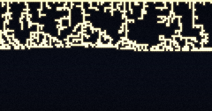 | `dla-hoarfrost`        | Diffusion-limited aggregation (inverted) | Witten & Sander 1981                       |
| 02 | 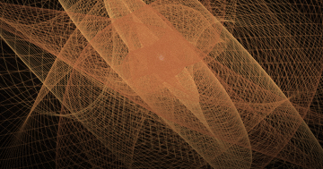 | `harmonograph`         | Damped-pendulum drawing machine        | Blackburn 1844 · Goold (Whitty 1893)       |
| 03 | 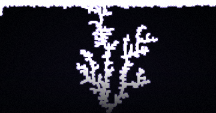 | `lichtenberg`          | Dielectric breakdown (tip-biased DLA heuristic) | Lichtenberg 1778 · Niemeyer–Pietronero–Wiesmann 1984 |
| 04 | 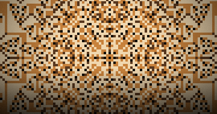 | `sandpile`             | Abelian sandpile                       | Bak–Tang–Wiesenfeld 1987 · Dhar 1990       |
| 05 | 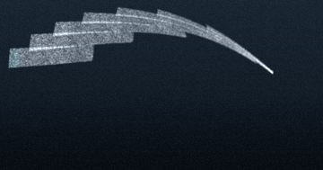 | `karman`               | Kármán vortex street                   | Strouhal 1878 · Bénard 1908 · von Kármán 1911 |
| 06 | 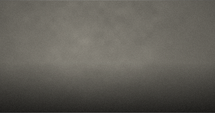 | `schlieren`            | Toepler schlieren (knife-edge)         | Toepler 1864 · Schardin 1934               |
| 07 | 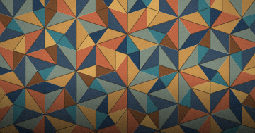 | `penrose`              | P3 rhomb tiling                        | Penrose 1974 · de Bruijn 1981              |
| 08 | 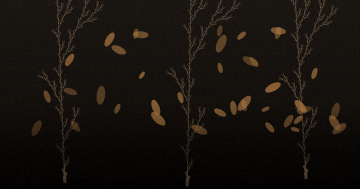 | `lsystem`              | L-system plants                        | Lindenmayer 1968 · Prusinkiewicz 1990      |
| 09 | 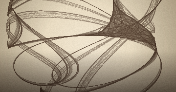 | `clifford`             | Strange attractor                      | Pickover 1990 (cf. de Jong 1987)           |
| 10 | 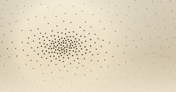 | `stippling`            | Poisson-disk blue noise                | Bridson 2007 · Mitchell 1987               |
| 11 |  | `painterly-atmosphere` | Color-field painting                   | Rothko, Frankenthaler (inspiration)        |
| 12 | 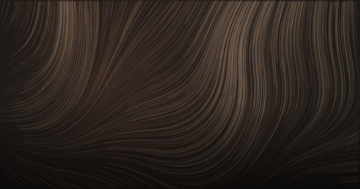 | `flow-fidenza`         | Flow-field strokes                     | Hobbs 2021 (technique only)                |
| 13 | 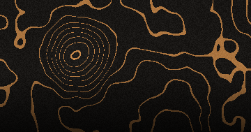 | `topo-contour`         | Topographic iso-lines                  | USGS contour ink · iso-line banding        |
| 14 | 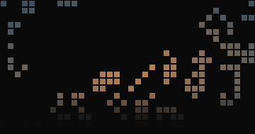 | `life-conway`          | Conway's Game of Life                  | Conway / Gardner 1970                      |
| 15 | 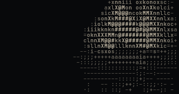 | `ascii-landscape`      | ASCII brightness-ramp landscape        | ASCII art tradition · aalib 1997 · Bourke 1997 |

Full primary-source citations are in [`ATTRIBUTIONS.md`](ATTRIBUTIONS.md) and
inside the doc comments of each `src/renderers/NN-name.ts` file.

## Project layout

```
better-covers/
├── src/
│   ├── shared/            Renderer signature + hashStr, mulberry32, fbm, addGrain
│   ├── renderers/
│   │   ├── 01-hoarfrost.ts ... 15-ascii.ts
│   │   └── index.ts
│   ├── Cover.tsx          The React component
│   ├── Gallery.tsx        The demo gallery
│   ├── covers.tsx         Catalog of all 15 covers with gallery metadata
│   ├── styles.ts          Gallery stylesheet
│   └── index.ts           Public barrel
├── docs/
│   ├── server-rendering.md
│   └── thumbnails/        README preview PNGs (npm run thumbnails)
├── ATTRIBUTIONS.md
├── CONTRIBUTING.md
├── CHANGELOG.md
├── LICENSE                MIT
└── README.md
```

## Determinism

Every renderer must be deterministic in `(W, H, SEED)`. Concretely:

- No `Math.random`. Use `mulberry32(seed)` or `hash2(x, y, seed)` from
  `better-covers/shared` instead.
- No `Date.now()`, `performance.now()`, `requestAnimationFrame`.
- Multiple renders at different canvas sizes are fine to differ, but the
  shape and seed should preserve identity (e.g. the Clifford attractor's
  parameters don't change with `W`).

This is what makes the covers usable at build time and from edge runtimes:
serialize a slug, get back the same image every time.

## Performance

At 1200 × 630, on a modern laptop CPU:

| Renderer          | Approx. ms |
| ----------------- | ---------- |
| painterly         | ~30        |
| flow              | ~80        |
| schlieren         | ~110       |
| topo              | ~150       |
| life              | ~180       |
| karman            | ~220       |
| ascii             | ~280       |
| clifford          | ~330       |
| stippling         | ~360       |
| harmonograph      | ~370       |
| hoarfrost         | ~480       |
| lichtenberg       | ~520       |
| lsystem           | ~580       |
| penrose           | ~720       |
| sandpile          | ~1 100     |

Numbers are rough; the goal was "no renderer over a second at production
size, with Satori, Takumi, or vanilla canvas." All measurements with Chromium 124 /
Node 22 on an M2.

## Browser / runtime support

- **Browsers**: Chromium, Firefox, Safari, Edge — anywhere the 2D canvas API
  is available and `OffscreenCanvas` or `<canvas>` works.
- **Server (Node)**: works with [`node-canvas`](https://github.com/Automattic/node-canvas)
  or [`@napi-rs/canvas`](https://github.com/Brooooooklyn/canvas). The ASCII
  renderer needs `document.createElement('canvas')`, which `node-canvas`
  does not polyfill out of the box — for SSR or build-time generation of the
  ASCII cover, see [`docs/server-rendering.md`](docs/server-rendering.md).
- **Edge runtimes** (Cloudflare Workers, Vercel Edge): use
  [`@vercel/og`](https://vercel.com/docs/og-image-generation) with the
  individual renderers; the `<Cover />` React tree won't run on the edge,
  but a renderer + an OffscreenCanvas polyfill will.

## Contributing

See [CONTRIBUTING.md](CONTRIBUTING.md) for the workflow, the renderer-quality
checklist, and the attribution-style guide. The short version:

- Open an issue first for a new cover idea — we want the collection to stay
  curated, not maximal.
- Every renderer needs a primary-source citation in the doc comment.
- No verbatim copies of named artworks (e.g. you may implement a flow field;
  you may not reproduce a specific Fidenza output).

## License

MIT — see [LICENSE](LICENSE).

The MIT license covers all original code in this repository. The
*algorithms* implemented here are part of the public scientific and
mathematical record, not subject to copyright. Names ("Fidenza", "Game of
Life", "Penrose tiling") are used nominatively to identify the underlying
phenomenon, not to imply endorsement by their creators. See
[ATTRIBUTIONS.md](ATTRIBUTIONS.md) for the full provenance trail.

## Acknowledgments

The collection is dedicated to the long tradition of people who looked
carefully at one ordinary thing — frost on a window, a wake behind a stone,
the way a pendulum loses energy — and described it precisely enough that
the rest of us could draw it. The fifteen names on the covers are stand-ins
for thousands of others.
